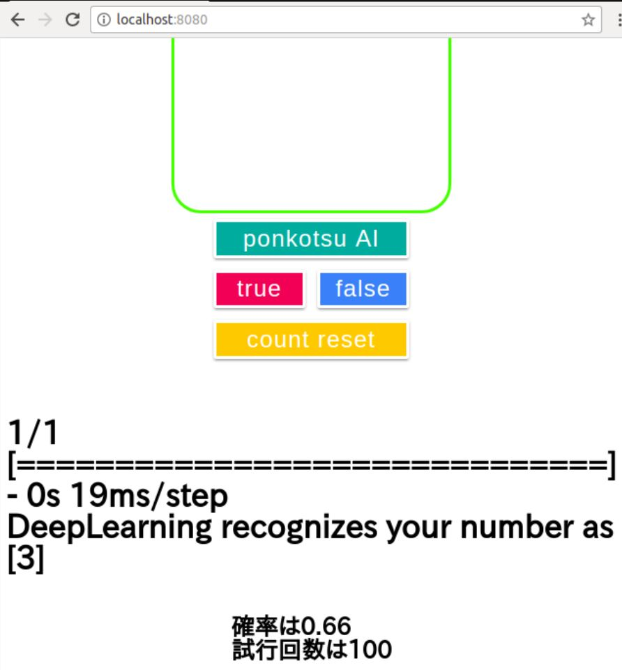
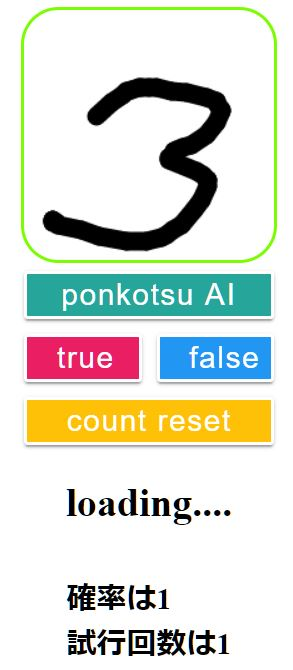

# 1digitrec(Neural Networkの勉強の一環として作ったもの)

- 66%の精度で一桁の手書き数字を認識するプログラム
- 緑の枠内に数字を書いてponkotsu AIボタンを押すと数字を認識してくれます。
- あっていたらtrue,間違っていたらfalseボタンを押すと、下に精度が記録されていきます(リロードすると記録は消えます)


# 概要
python(機械学習側)

- jupyter notebookでkeras-mnist.ipynbを動かして学習させたモデルをkeras-mnist.h5に保存
- main.pyはkeras_mnist.pyを呼び出す
- keras_mnist.pyで保存したkeras-mnist.h5を読み込み、手書き文字を予測

html(client側)
- canvasに入力された画像を1/10に縮小してbase64にして、node.js(サーバー側)に送る

node.js(server側)
- client側から受け取った画像をmain.pyに渡す


# 環境
ubuntuでのみ動作を確認。
- python
  - numpy, scipy, tensorflow, keras, pillow
- node.js
  - express

コマンドラインで
```
$ node index.js
```
と打ち、localhost:8080にアクセスすると使えます。


# 課題
- MNISTでは90%を超える精度だったのに、実際の手書き文字入力では6割程度の正答率にとどまるのはなぜか。
  - データセットの違い？(MNISTは文字の濃さがあるが、canvasに入力するときは 255 or 0 で濃さの概念がない。)


# 参考画像





